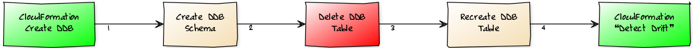
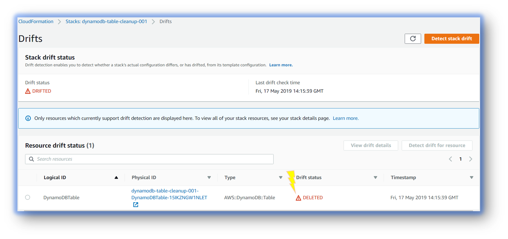
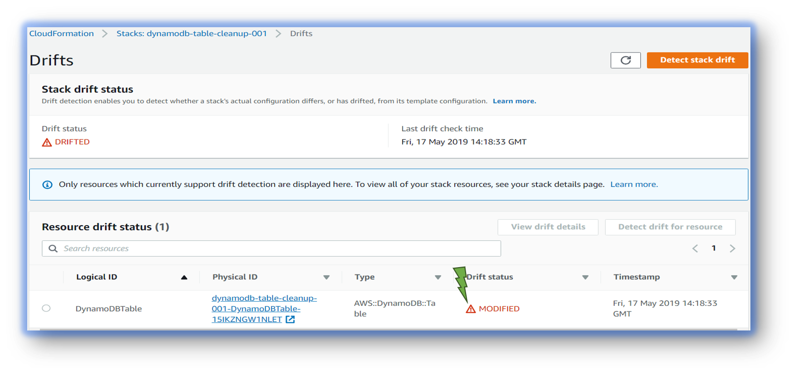

# AWS DynamoDB Table CleanUp - All Items Deletion

Lets say you have a cloudformation stack, that created DynamoDB table and few other resources for you. For some reason if you have to delete all items in the DynamoDB table but not delete the stack, How  will you do it?.



#### Follow this article in [Youtube](https://youtube.com/c/valaxytechnologies)

0. ### Prerequisites

- AWS CLI pre-configured

1. ## Clone the repository

   ```bash
   git clone https://github.com/miztiik/dynamodb-table-cleanup.git
   ```

1. ## Customize the deployment

    Edit the `./helper_scripts/deploy.sh` to update your environment variables.
  
    ```bash
    AWS_PROFILE="default"
    AWS_REGION="us-east-1"
    BUCKET_NAME="sam-templates-011" # bucket must exist in the SAME region the deployment is taking place
    SERVICE_NAME="dynamodb-cleanup-demo"
    TEMPLATE_NAME="${SERVICE_NAME}.yaml" # The CF Template should be the same name, If not update it.
    STACK_NAME="${SERVICE_NAME}-001"
    OUTPUT_DIR="./outputs/"
    PACKAGED_OUTPUT_TEMPLATE="${OUTPUT_DIR}${STACK_NAME}-packaged-template.yaml"
    ```

1. ## Deployment

    We will use the `deploy.sh` in the `helper_scripts` directory to deploy our [AWS SAM](https://github.com/awslabs/serverless-application-model) template

    ```bash
    chmod +x ./helper_scripts/deploy.sh
    ./helper_scripts/deploy.sh
    ```
  
1. ## Insert few Items

    Insert a simple item to the table, either from the GUI/CLI

    ```json
    ddb_name="dynamodb-table-cleanup-001-DynamoDBTable-15IKZNGW1NLET"
    for i in {1..10}
     do
      val=${RANDOM}
      aws dynamodb put-item \
        --table-name "${ddb_name}" \
        --item '{ "Username": {"S":"User_'${i}'"},"Timestamp": {"S":"'$(date +"%d/%m/%Y-%H:%M:%S")'"},"Message":{"S":"Mystique_Msg_'${val}'"} }'
     done
    ```

1. Backup DDB Schema & Delete Table

    ```bash
    yum -y install jq
    aws dynamodb describe-table --table-name "${ddb_name}" | jq '.Table | del(.TableId, .TableArn, .ItemCount, .TableSizeBytes, .CreationDateTime, .TableStatus, .LatestStreamArn, .LatestStreamLabel, .ProvisionedThroughput.NumberOfDecreasesToday, .ProvisionedThroughput.LastIncreaseDateTime)' > schema.json

    aws dynamodb delete-table --table-name "${ddb_name}"
    ```

    At this moment, if you check the stack for drift, you will notice it had identified the table had been deleted.
    

1. ReCreate Table & Verify Stack still owns the DDB

    Using the schema of the old table, We should be able to create a new table with the same attributes. _If you have a hugh table, wait for couple of minutes and confirm table deletion before executing the below command for table creation._

    ```bash
    aws dynamodb create-table --cli-input-json file://schema.json
    ```

    Under Cloudformation, We have a new `Detect Drift` option(_[More on this here](https://www.youtube.com/watch?v=YN4UOXSb74A)_). Initiate Drift Detection. You will find that the `Dynamo DB` resources had been tagged as modified but still under the managed of cloudformation stack.

    

### CleanUp

  If you want to destroy all the resources created by the stack, Execute the below command to delete the stack, or _you can delete the stack from console as well_

  ```bash
  # Delete the CF Stack
  ./helper_scripts/deploy.sh nuke
  ```

### Contact Us

You can reach out to us to get more details through [here](https://youtube.com/c/valaxytechnologies/about).